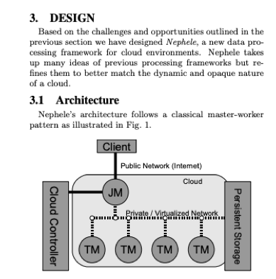
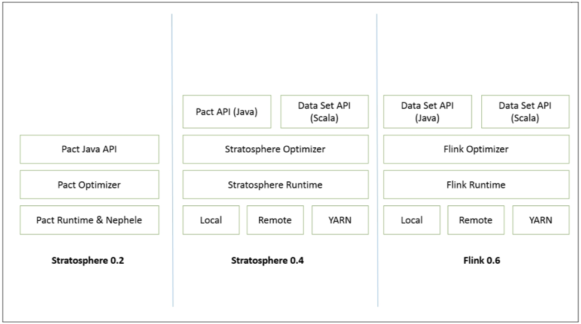
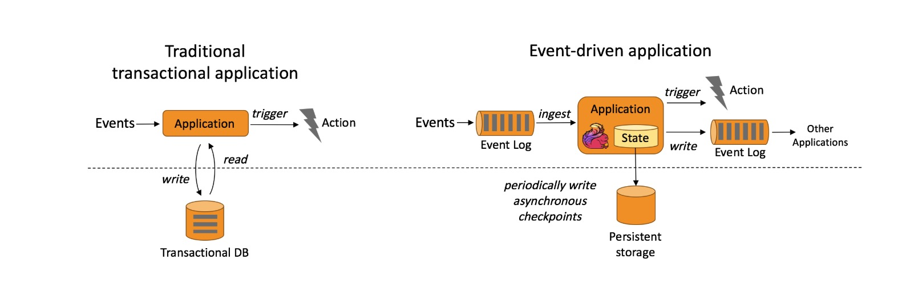
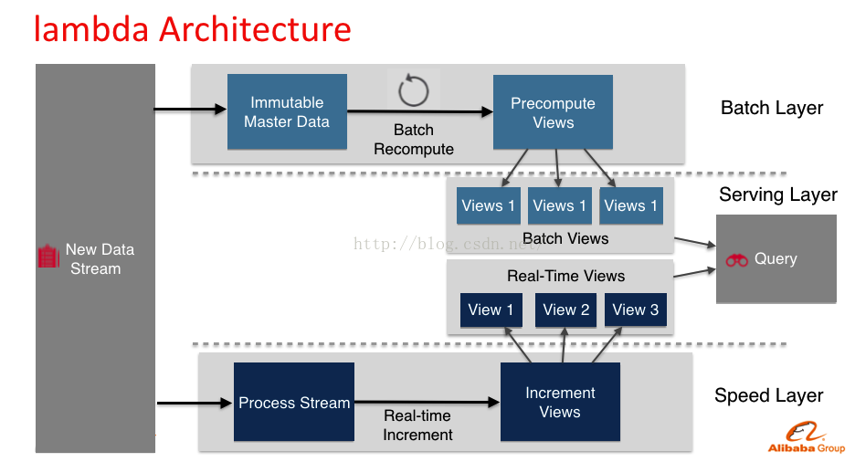
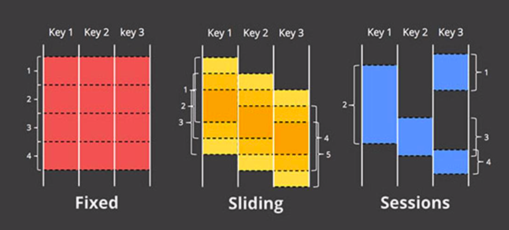
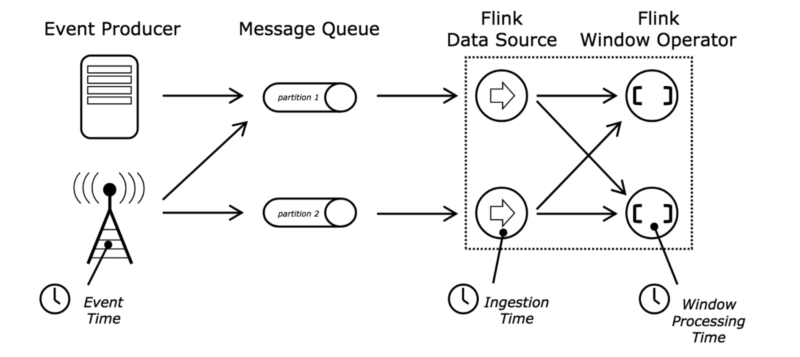
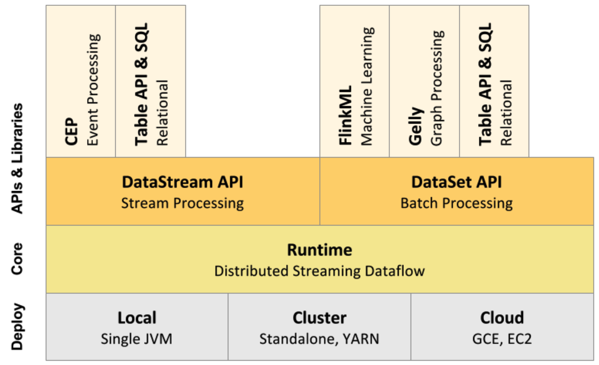
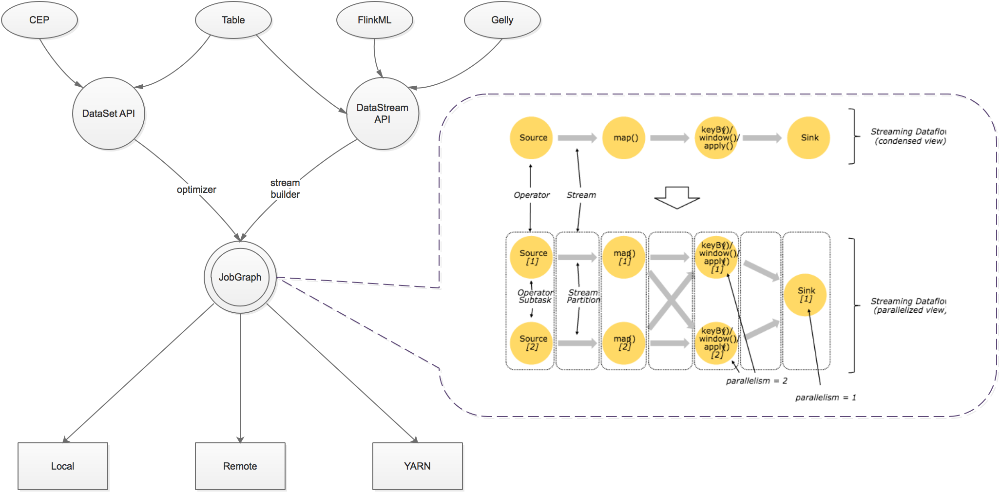

**目录**


# 0.  What is Apache Flink

>是一个支持实时分析和实时计算的开源的分布式 **流处理** 平台。 Apache Flink 能够提供高效，快速，准确和容错的高容量的有界/无界事件流处理能力。

Apache Flink 是一个框架和分布式处理引擎，用于在无边界和有边界数据流上进行有状态的计算。Flink 能在所有常见集群环境中运行，并能以内存速度和任意规模进行计算。


## 处理无界和有界数据
任何类型的数据都可以形成一种事件流。信用卡交易、传感器测量、机器日志、网站或移动应用程序上的用户交互记录，所有这些数据都形成一种流。


数据可以被作为 无界 或者 有界 流来处理。

无界流 有定义流的开始，但没有定义流的结束。

>它们会无休止地产生数据。无界流的数据必须持续处理，即数据被摄取后需要立刻处理。

我们不能等到所有数据都到达再处理，因为输入是无限的，在任何时候输入都不会完成。
处理无界数据通常要求以特定顺序摄取事件，例如事件发生的顺序，以便能够推断结果的完整性。

有界流 有定义流的开始，也有定义流的结束。有界流可以在摄取所有数据后再进行计算。有界流所有数据可以被排序，所以并不需要有序摄取。有界流处理通常被称为批处理

# 1. 前世今生

Flink 起源于 2009 年，柏林工业大学的一个名叫 **[Stratosphere](http://stratosphere.eu/) 「平流层」** 的研究项目。旨在 **设计下一代的大数据分析平台** 。
- 在 2014 年 4月贡献给了 Apache 基金会。
在 2015 年 1月成为 Apache 顶级项目

>初代的 Stratosphere 专注于 底层的运行时，优化器，和 java API的设计。而后，整个平台趋于 成熟, 0.6 之后 更名 Flink 。0.7 之后 引入了 Streaming API 。

##  1. 早期的设计



##  2. 早期的设计变迁



## 3. 优点/特性

- 高性能.
Flink旨在实现高性能和低延迟。与其他流式框架（如Spark）不同，您无需执行许多手动配置即可获得最佳性能。与其对应物相比，Flink的流水线数据处理提供了更好的性能。

- Exactly-once 状态计算
Flink的分布式检查点处理有助于保证每个记录只处理一次。在高吞吐量应用程序的情况下，Flink为我们提供了一个允许至少一次处理的开关。

- 灵活的流式传输windows
Flink支持数据驱动的窗口。这意味着我们可以根据时间，计数或会话设计一个窗口。还可以定制一个窗口，允许我们检测事件流中的特定模式.

- Fault tolerance
Flink的分布式轻量级快照机制有助于实现高度的容错能力。它允许Flink提供高吞吐量的性能和有保证的交付。内存管理.Flink在JVM中提供了自己的内存管理，使其独立于Java的默认垃圾收集器。它通过使用散列，索引，缓存和排序有效地进行内存管理.

- Optimizer
Flink的批处理数据处理 API 经过优化，以避免消耗内存，排序等内存消耗。它还确保使用缓存以避免繁重的磁盘IO操作。

- platform 一个统一的计算平台

Flink中的流和批处理为批处理和流数据处理提供 API 。因此，一旦设置了Flink环境，它就可以轻松地托管流和批处理应用程序。事实上，Flink在Streaming第一原理上工作，并将批处理视为streaming的特殊情况.

- Libraries
Flink拥有丰富的库来进行机器学习，图形处理，关系数据处理等。由于其架构，很容易执行复杂的事件处理和警报。

- 事件时间语义.
Flink支持事件时间语义。这有助于处理事件无序到达的流。有时事件可能会延迟。 Flink的架构允许我们根据时间，计数和会话定义窗口，这有助于处理这些场景。


## 4. <a name=''></a> 应用场景

- Event-Driven Applications
    - 实时推荐系统
    - 模式识别类的应用（如 信用卡交易中的欺诈检测）
    - 支付宝安全检测
- Data Pipelines
    - 系统升级，数据迁移等
- Streaming Analytics

----

# 概念介绍

- What is Stream Processing?

>事件驱动型应用是一类具有状态的应用，它从一个或多个事件流提取数据，并根据到来的事件触发计算、状态更新或其他外部动作。

>事件驱动型应用是在计算存储分离的传统应用基础上进化而来。在传统架构中，应用需要读写远程事务型数据库。

>相反，事件驱动型应用是基于状态化流处理来完成。在该设计中，数据和计算不会分离，应用只需访问本地（内存或磁盘）即可获取数据。系统容错性的实现依赖于定期向远程持久化存储写入 checkpoint。下图描述了传统应用和事件驱动型应用架构的区别。



>例如基于事件时间的有且仅有一次性语义保证和数据窗口，开发人员不再需要在应用程序层中考虑这些问题。 这种风格导致更少的错误。

>原有的开源大数据计算方案(lambda 架构)，会把流处理和批处理作为两种不同的应用类型，因为它们所提供的SLA（Service-Level-Aggreement）是完全不相同的：流处理一般需要支持低延迟、Exactly-once保证，而批处理需要支持高吞吐、高效处理。



>Flink从另一个视角看待流处理和批处理，将二者统一起来：Flink是完全支持流处理，也就是说作为流处理看待时输入数据流是无界的；**批处理被作为一种特殊的流处理，只是它的输入数据流被定义为有界的**。

##  3. 数据流编程模型

###  3.1. 抽象级别


- Flink提供了不同级别的抽象，以开发流或批处理作业。


---

- 最底层级的抽象仅仅提供了有状态流。

>它将通过过程函数（Process Function）嵌入到 DataStream API 中。它允许用户可以自由地处理来自一个或多个数据流的件，并使用一致的容错的状态。除此之外，用户可以注册事件时间并处理时间回调，从使程序可以处理复杂的计算。

- 实际上，大多数应用并不需要上述的底层抽象，而是针对 核心 API （Core API ） 进行编程
 
>比如 DataStream API （有界或无界流数据）以及 DataSet API 有界数据集）。这些 API 为数据处理提供了通用的构建模块，比如由用户定义的多种式的转换（transformations），连接（joins），聚合（aggregations），窗操作（windows），状态（state）等等。这些 API 处理的数据类型以类（classe）的形式由各自的编程语言所表示。

- 底层 过程函数（Process Function） 与 DataStream API相集成，使其可以某些特定的操作进行底层的抽象。 

  DataSet API为有界数据集提供了额外的原语，如循环与迭代。
- Table API是以 表 为中心的声明式DSL，其中表可能会动态变化（在表达流数据）。
  Table API 遵循（扩展的）关系模型：表有二维数据结构（schema）（类似于系数据库中的表），同时 API 提供可比较的操作，例如select、project、joi、group-by、aggregate等。Table API 程序声明式地定义了 什么逻辑操作应该行 而不是准确地确定 这些操作代码的看上去如何 。 尽管Table API 可以通过多类型的用户自定义函数（UDF）进行扩展，其仍不如 核心 API更具表达能力，但是使起来却更加简洁（代码量更少）。除此之外，Table API 程序在执行之前会经过内置化器进行优化。
- 你可以在表与 DataStream / DataSet 之间无缝切换，以允许程序将 TableAPI与 DataStream 以及 DataSet 混合使用。

>用户可以通过各种方法将数据进行转换 / 计算。
    - map
    - flatmap
    - window
    - keyby
    - sum
    - max
    - min
    - avg
    - join 等

- Flink提供的最高层级的抽象是 SQL 。这一层抽象在语法与表达能力上与 TableAPI类似，但是是以SQL查询表达式的形式表现程序。SQL抽象与Table API 交互密，同时SQL查询可以直接在Table API 定义的表上执行。

###  3.2. <a name='-1'></a>程序与数据流

- Flink程序的基础构建模块是 流（streams） 与 转换（transformations）。（需要注意的是，Flink的 DataSet API 所使用的 DataSet s其内部也是流。）概念上来讲，流是（可能永无止境的）数据记录流，而 转换 是一种操作，它取一个或多个流作为输入，并生产出一个或多个输出流作为结果。

- 执行时，Flink程序映射到 流数据流（streaming dataflows） ，由 流 以及转换 算子 构成。每一个数据流起始于一个或多个 source，并终止于一个或多个 sink。数据流类似于任意的 有向无环图 （DAG） 。虽然通过 迭代 构造允许特定形式的环，但是大多数情况下，简单起见，我们都不考虑这一点。


通常，程序中的转换与数据流中的操作之间是一对一的关系。有时，然而，一个转换可能由多个转换操作构成。

1. Source: 数据源，Flink 在流处理和批处理上的 source 大概有 4 类：基于本地集合的 source、基于文件的 source、基于网络套接字的 source、自定义的 source。自定义的 source 常见的有 Apache kafka、Amazon Kinesis Streams、RabbitMQ、Twitter Streaming API 、Apache NiFi 等，当然你也可以定义自己的 source。

2. Transformation：数据转换的各种操作，有 Map / FlatMap / Filter / KeyBy / Reduce / Fold / Aggregations / Window / WindowAll / Union / Window join / Split / Select / Project 等，操作很多，可以将数据转换计算成你想要的数据。

3. Sink：接收器，Flink 将转换计算后的数据发送的地点 ，你可能需要存储下来，Flink 常见的 Sink 大概有如下几类：写入文件、打印出来、写入 socket 、自定义的 sink 。自定义的 sink 常见的有 Apache kafka、RabbitMQ、MySQL、ElasticSearch、Apache Cassandra、Hadoop FileSystem 等，同理你也可以定义自己的 sink。

###  3.3. <a name='-1'></a>并行数据流

Flink程序本质上是并行分布的。在执行过程中，一个 流 包含一个或多个 流分区 ，而每一个 算子 包含一个或多个 算子 子任务 。操作子任务间彼此独立，以不同的线程执行，甚至有可能运行在不同的机器或容器上。

算子 子任务的数量即这一特定 算子 的 **并行度** 。一个流的并行度即其生产算子的并行度。相同程序中的不同的算子可能有不同级别的并行度。


流在两个算子之间传输数据，可以通过 一对一 （或称 forwarding ）模式，或者通过 redistributing 模式：

- 一对一 流
>（例如上图中 Source 与 map算子之间）保持了元素的分区与排序。那意味着 map 算子的子任务[1]将以与 Source 的子任务[1]生成顺序相同的顺序查看到相同的元素。

- Redistributing 流（如上图中 map() 与 keyBy/window 之间，以及 keyBy/window 与 Sink 之间）则改变了流的分区。
>每一个算子子任务 根据所选择的转换，向不同的目标子任务发送数据。
比如 `keyBy()` （根据key的哈希值重新分区）， broadcast() ，或者 rebalance() （随机重分区）。
在一次 redistributing 交换中，元素间的排序只保留在每对发送与接受子任务中（比如， map() 的子任务[1]与 keyBy/window 的子任务[2]）。
因此在这个例子中，每个键的顺序被保留下来，但是并行确实引入了对于不同键的聚合结果到达sink的顺序的不确定性。

---

###  3.4. <a name='window'></a>窗口 window

聚合事件（比如计数、求和）在流上的工作方式与批处理不同。比如，对流中的所有元素进行计数是不可能的，因为通常流是无限的（无界的）。相反，流上的聚合需要由 窗口 来划定范围，比如 “计算过去的5分钟” ，或者 “最后100个元素的和” 。


窗口可以是 事件驱动的 （比如：每30秒）或者 数据驱动的 （比如：每100个元素）。窗口通常被区分为不同的类型，比如 滚动窗口 （没有重叠）， 滑动窗口 （有重叠），以及 会话窗口 （由不活动的间隙所打断）



###  3.5. <a name='time'></a>时间 time

当提到流程序（例如定义窗口）中的时间时，你可以参考不同的时间概念：


- 事件时间(Event Time) 是事件创建的时间。它通常由事件中的时间戳描述，例如附接在生产传感器，或者生产服务。Flink通过时间戳分配器访问事件时间戳。

- 摄入时间(Ingestion Time) 是事件进入Flink数据流源算子的时间。

- 处理事件(Processing Time) 是每一个执行时间操作的算子的本地时间。

###  3.6. <a name='statefualoperate'></a>有状态操作 statefual operate

尽管数据流中的很多操作一次只查看一个独立的事件（比如事件解析器），有些操作却会记录多个事件间的信息（比如窗口算子）。 这些操作被称为 有状态的 。

有状态操作的状态保存在一个可被视作嵌入式键/值存储的部分中。状态与由有状态算子读取的流一起被严格地分区与分布。因此，只能访问一个 keyBy() 函数之后的 keyed streams 的键/值状态，并且仅限于与当前事件键相关联的值。对齐流和状态的键确保了所有状态更新都是本地操作，以在没有事务开销的情况下确保一致性。这种对齐还使得Flink可以透明地重新分配状态与调整流的分区。


###  3.7. <a name='checkpoint'></a>容错检查点 checkpoint


Flink使用 流重放 与 Checkpoint 的结合实现了容错。Checkpoint与每一个输入流及其相关的每一个算子的状态的特定点相关联。一个流数据流可以可以从一个checkpoint恢复出来，其中通过恢复算子状态并从检查点重放事件以保持一致性（一次处理语义）

检查点间隔是以恢复时间（需要重放的事件数量）来消除执行过程中容错的开销的一种手段。

>它不断为 分布式数据流 和 执行器状态 拍摄快照. 设计灵感来自 Chandy-Lamport 算法，但已根据Flink的定制要求进行了修改,如果发生任何故障，Flink将停止执行程序并重置它们并从最新的可用检查点开始执行,在绘制快照时，Flink处理记录的对齐，以避免因任何故障而重新处理相同的记录

###  3.8. <a name='-1'></a>流上的批处理

Flink将批处理程序作为流处理程序的特殊情况来执行，只是流是有界的（有限个元素）。 DataSet 内部被视为数据流。上述适用于流处理程序的概念同样适用于批处理程序，除了一些例外：

- DataSet API 中的程序不使用检查点。而通过完全地重放流来恢复。因为输入是有界的，因此这是可行的。这种方法使得恢复的成本增加，但是由于避免了检查点，因而使得正常处理的开销更小。

- DataSet API 中的有状态操作使用简化的im-memory/out-of-core数据结构，而不是键/值索引。

- DataSet API 引入了特殊的同步（基于superstep的）迭代，而这种迭代仅仅能在有界流上执行。细节可以查看迭代文档。

----

##  4. <a name='-1'></a>分布式运行时环境

###  4.1. <a name='-1'></a>任务和算子链

分布式计算中，Flink会将算子（operator） 的子task链式组成tasks，每个task由一个线程执行。把算子链化为tasks是一个非常好的优化：它减少了线程之间的通信和缓冲，而且还能增加吞吐量降低延迟。

下图中dataflow有5个subtasks，因此有5个线程并发进行处理。


###  4.2. <a name='JobManagersTaskManagersClients'></a>Job Managers, Task Managers, Clients

Flink运行时包含两类进程：

- JobManagers （也称为 masters）用来协调分布式计算。负责进行任务调度，协调checkpoints，协调错误恢复等等。至少需要一个JobManager。高可用部署下会有多个JobManagers，其中一个作为leader，其余处于standby状态。

- TaskManagers（也称为 workers）真正执行dataflow中的tasks（更准确的描述是，subtasks），并且对 streams进行缓存和交换。至少需要一个TaskManager。

有多种方式可以启动JobManagers和TaskManagers：直接在计算机上启动作为 standalone cluster，在容器中或者由资源管理器YARN 或者 Mesos启动。 TaskManagers连接到JobManagers后，会通知JobManagers自己已可用，接着被分配工作。

client 不作为运行时（runtime）和程序执行的一部分，只是用于准备和发送dataflow作业给JobManager。 因此客户端可以断开连接，或者保持连接以接收进度报告。客户端可以作为触发执行的Java/Scala 程序的一部分或者运行在命令行进程中 `./bin/flink run ...`。


###  4.3. <a name='TaskSlotsandResources'></a>Task Slots and Resources

>'Flink数据流默认是以分布式并行的方式执行的。对于并行数据处理，Flink对 算子和流进行分区。算子 分区称为子任务(sub tasks)。'

每个 worker ( TaskManager)都是一个 JVM 进程，并且可以在不同的线程中执行一个或多个subtasks。每个 worker用 task slots（任务槽位） (至少有一个)来控制可以接收多少个 tasks。

每个task slot代表TaskManager中一个固定的资源子集。例如，有3个slots的TaskManager会将它的内存资源划分成3份分配给每个slot。划分资源意味着subtask不会和来自其他作业的subtasks竞争资源，但是也意味着它只拥有固定的内存资源。注意划分资源不进行CPU隔离，只划分内存资源给不同的tasks。

通过调整 slots 的个数进而可以调整 subtasks 之间的隔离方式。当每个 TaskManager 只有一个 slot 时，意味着每个 task group 运行在不同的JVM中（例如：可能在不同的container中）。当每个TaskManager有多个slots时，意味着多个subtasks可以共享同一个JVM。同一个JVM中的tasks共享TCP连接（通过多路复用技术）和心跳消息。可能还会共享数据集和数据结构，从而减少每个task的开销。


默认情况下，只要subtasks是来自同一个job，Flink允许不同tasks的subtasks共享slots。因此，一个slot可能会负责job的整个pipeline。允许slot sharing有两个好处：

Flink集群需要的slots的数量和job的最高并发度相同，不需要计算一个作业总共包含多少个tasks（具有不同并行度）。

更易获取更好的资源利用率。没有slot sharing，非集中型subtasks（source/map()）将会占用和集中型subtasks （window）一样多的资源。在我们的示例中，允许共享slot，可以将示例作业的并发度从2增加到6，从而可以充分利用资源，同时保证负载很重的subtasks可以在TaskManagers中平均分配。


 API s还包含了一种 *资源组（resource group）* 机制，用来防止不必要的slot sharing。

经验来讲，task slots的默认值应该与CPU核数一致。在使用超线程下，一个slot将会占用2个或更多的硬件资源。

###  4.4. <a name='StateBackends'></a>状态管理 State Backends

key/values 索引存储的准确数据结构取决于选择的 state backend。其中一个 state backend将数据存储在内存hash map中，另一个 state backend使用RocksDB作为key/value 存储。 除了定义存储状态的数据结构， state backends还实现了获取 key/value状态的时间点快照的逻辑，并将该快照存储为checkpoint的一部分。


###  4.5. <a name='Savepoints'></a>Savepoints

使用DataStream API 编写的程序可以从一个savepoint恢复执行。Savepoints允许在不丢失任何状态的情况下修改程序和Flink集群。

Savepoints 是手动触发的checkpoints，它依赖常规的checkpointing机制，生成程序快照并将其写入到状态后端。在运行期间，worker节点周期性的生成程序快照并产生checkpoints。在恢复重启时只会使用最后成功的checkpoint。并且只要有一个新的checkpoint生成时，旧的checkpoints将会被安全地丢弃。

Savepoints与周期性触发的checkpoints很类似，但是其式由由用户触发的，且当更新的checkpoints完成时，老的checkpoint不会自动失效。可以通过命令行或者在取消一个job时调用REST API 的方式创建Savepoints。

##  5. <a name='checkpoint-1'></a>checkpoint

>checkpoint使Fink的状态具有非常好的容错性，通过Checkpoint，Flink可以对作业的状态和计算位置进行恢复，因此Flink作业具备高容错执行语意。 通过 Checkpointing 查看如何在程序中开启和配置checkpoint。

`保留Checkpoint`

默认情况下，Checkpoint仅用于恢复失败的作业，是不保留的，程序结束时Checkpoints也会被删除。然而，你可以配置周期性的保留checkpoint。当作业失败或被取消时，这些checkpoints将不会被自动清除。这样，你就可以用该checkpoint来恢复失败的作业。

``` java

CheckpointConfig config = env.getCheckpointConfig();
config.enableExternalizedCheckpoints(ExternalizedCheckpointCleanup.RETAIN_ON_CANCELLATION);
```

“ExternalizedCheckpointCleanup”配置项定义了当作业取消时，对作业checkpoints的操作：

- ExternalizedCheckpointCleanup.RETAIN_ON_CANCELLATION: 作业取消时，保留作业的checkpoint。注意，这种情况下，需要手动清除该作业的checkpoint。
- ExternalizedCheckpointCleanup.DELETE_ON_CANCELLATION: 作业取消时，删除作业的checkpoint。仅当作业失败时，作业的checkpoint才会被使用。


`目录结构`

与 savepoints 类似， checkpoint由元数据文件、额外的数据文件（与state backend相关）组成。可以通过配置文件中“state.checkpoints.dir”配置项，指定元数据文件和数据文件的存储路径，也可以在代码中针对单个作业指定该配置。

- 通过配置文件全局配置

``` shell
state.checkpoints.dir: hdfs:///checkpoints/
```
创建state backend时对单个作业进行配置#

``` java
env.setStateBackend(new RocksDBStateBackend("hdfs:///checkpoints-data/");
```

`checkpoint与savepoint的区别`

checkpoint与savepoint有一些区别。 他们

-的数据格式与state backend密切相关，可能以增量方式存储。
- 不支持Flink的特殊功能，如扩缩容。
`从checkpoint中恢复状态`

同savepoint一样，作业也可以使用checkpoint的元数据文件进行错误恢复。注意若元数据文件中信息不够，那么jobmanager就需要使用相关的数据文件来恢复作业。
``` shell
$ bin/flink run -s :checkpointMetaDataPath [:runArgs]
```

---

##  6. <a name='Savepoint'></a>Savepoint

>Savepoints是存储在外部文件系统的的自完备的checkpoints，可以用来停止-恢复或升级Flink程序。其使用Flink的 checkpoint机制 创建流作业的全量（非增量）状态快照，并且将checkpoint数据和元数据写出到外部文件系统。

`分配算子ID`

**墙裂推荐**   通过“uid(String)”手动指定算子ID。这些ID将在确定每个算子的状态时使用。

``` java
 DataStream <String> stream = env.
  // Stateful source (e.g. Kafka) with ID
  .addSource(new StatefulSource())
  .uid("source-id") // ID for the source operator
  .shuffle()
  // Stateful mapper with ID
  .map(new StatefulMapper())
  .uid("mapper-id") // ID for the mapper
  // Stateless printing sink
  .print(); // Auto-generated ID
```

如果不手动指定算子ID，ID将自动生成。只要这些ID不改变，就可以从savepoint中自动恢复状态。自动生成的ID依赖于程序的结构，并且非常容易受到程序变化的影响。因此，墙裂推荐手动指定ID。

`Savepoint状态`

你可以将savepoint想象成为保存了每个有状态的算子的“算子ID->状态”映射的集合。
```
Operator ID | State
------------+------------------------
source-id   | State of StatefulSource
mapper-id   | State of StatefulMapper
```
在上述示例中，print结果表是无状态的，因此不是savepoint状态的一部分。默认情况下，我们试图将savepoint的每条数据，都映射到新的程序中。


# stream processing fundamentals

# architecture of Apache Flink

>为什么 Flink 能同时支持批处理和流处理呢？
>Flink将批处理（即静态和有限数据集合的处理）视为流处理的一种特例。

Flink 是一个分层设计的系统。栈中的不同层次构建在彼此之上，并提供不同的抽象级别的功能。

从下至上：

- Runtime 层以 JobGraph 形式接收程序。JobGraph 即为一个一般化的并行有向无环数据流图（data flow），它拥有任意数量的 Task 来接收和产生 DataStream。
- DataStream API 和 DataSet API 都会使用单独编译的方式生成JobGraph。 DataSet API 使用 optimizer 来决定针对程序的优化方法，而 DataStream API 则使用 stream builder 来完成该任务。
- 在执行JobGraph时，Flink提供了多种候选部署方案（如local，remote，YARN，云端部署等）。
- Flink 附随了一些产生 DataSet 或 DataStream API 程序的的类库和 API ：处理逻辑表查询的Table，机器学习的FlinkML，图像处理的Gelly，复杂事件处理的CEP等。




`Runtime`

标识为“Runtime”的是Flink的分布式运行环境，是Flink核心计算结构系统，它接受流数据流程序并在一台或多台机器中以容错方式执行它们。

- Rumtime 接受的程序非常强大，但是直接基于它编程很困难。出于这个原因，Flink提供了开发人员友好的 API ，这些 API 在 Rumtime 层之上进行分层并生成这些流数据流程序。有用于流处理的 DataStream API 和用于批处理的 DataSet API 。值得注意的是，虽然Flink的运行时总是基于流，但 DataSet API 早于 DataStream API ，因为处理无限流的行业需求在第一个Flink年代并没有那么广泛。



# 架构演化

##  7. <a name='time-1'></a>`time`

Flink 在流程序中支持不同的 Time 概念
- Processing Time
- Event Time
- Ingestion Time

下面我们一起来看看这几个 Time：

`Processing Time`

>Processing Time 是指事件被处理时机器的系统时间。

当流程序在 Processing Time 上运行时，所有基于时间的操作(如时间窗口)将使用当时机器的系统时间。每小时 Processing Time 窗口将包括在系统时钟指示整个小时之间到达特定操作的所有事件。

例如，如果应用程序在上午 9:15 开始运行，则第一个每小时 Processing Time 窗口将包括在上午 9:15 到上午 10:00 之间处理的事件，下一个窗口将包括在上午 10:00 到 11:00 之间处理的事件。

Processing Time 是最简单的 “Time” 概念，不需要流和机器之间的协调，它提供了最好的性能和最低的延迟。但是，在分布式和异步的环境下，Processing Time 不能提供确定性，因为它容易受到事件到达系统的速度（例如从消息队列）、事件在系统内操作流动的速度以及中断的影响。

`Event Time`

>Event Time 是事件发生的时间，一般就是数据本身携带的时间。这个时间通常是在事件到达 Flink 之前就确定的，并且可以从每个事件中获取到事件时间戳。在 Event Time 中，时间取决于数据，而跟其他没什么关系。Event Time 程序必须指定如何生成 Event Time 水印(Watermark)，这是表示 Event Time 进度的机制。

在按业务发生时间统计数据时，面临一个问题，当接收数据的时间是无序的时候，我们什么时间去触发聚合计算，不可能无限制的等待。Flink引入了Watermark的概念，它是给窗口看的，是告诉窗口最长等待的时间是多久，超过这个时间的数据就抛弃不再处理。

完美的说，无论事件什么时候到达或者其怎么排序，最后处理 Event Time 将产生完全一致和确定的结果。但是，除非事件按照已知顺序（按照事件的时间）到达，否则处理 Event Time 时将会因为要等待一些无序事件而产生一些延迟。由于只能等待一段有限的时间，因此就难以保证处理 Event Time 将产生完全一致和确定的结果。

假设所有数据都已到达， Event Time 操作将按照预期运行，即使在处理无序事件、延迟事件、重新处理历史数据时也会产生正确且一致的结果。 例如，每小时事件时间窗口将包含带有落入该小时的事件时间戳的所有记录，无论它们到达的顺序如何。

请注意，有时当 Event Time 程序实时处理实时数据时，它们将使用一些 Processing Time 操作，以确保它们及时进行。


`Ingestion Time`

>Ingestion Time 是事件进入 Flink 的时间。 在源操作处，每个事件将源的当前时间作为时间戳，并且基于时间的操作（如时间窗口）会利用这个时间戳。

Ingestion Time 在概念上位于 Event Time 和 Processing Time 之间。 与 Processing Time 相比，它稍微贵一些，但结果更可预测。因为 Ingestion Time 使用稳定的时间戳（在源处分配一次），所以对事件的不同窗口操作将引用相同的时间戳，而在 Processing Time 中，每个窗口操作符可以将事件分配给不同的窗口（基于机器系统时间和到达延迟）。

与 Event Time 相比，Ingestion Time 程序无法处理任何无序事件或延迟数据，但程序不必指定如何生成水印。

在 Flink 中，Ingestion Time 与 Event Time 非常相似，但 Ingestion Time 具有自动分配时间戳和自动生成水印功能。

`Event Time 和 Watermarks`

>支持 Event Time 的流处理器需要一种方法来衡量 Event Time 的进度。 例如，当 Event Time 超过一小时结束时，需要通知构建每小时窗口的窗口操作符，以便操作员可以关闭正在进行的窗口。

Event Time 可以独立于 Processing Time 进行。 例如，在一个程序中，操作员的当前 Event Time 可能略微落后于 Processing Time （考虑到接收事件的延迟），而两者都以相同的速度进行。另一方面，另一个流程序可能只需要几秒钟的时间就可以处理完 Kafka Topic 中数周的 Event Time 数据。

Flink 中用于衡量 Event Time 进度的机制是 Watermarks。 Watermarks 作为数据流的一部分流动并带有时间戳 t。 Watermark（t）声明 Event Time 已到达该流中的时间 t，这意味着流中不应再有具有时间戳 t’<= t 的元素（即时间戳大于或等于水印的事件）

下图显示了带有(逻辑)时间戳和内联水印的事件流。在本例中，事件是按顺序排列的(相对于它们的时间戳)，这意味着水印只是流中的周期性标记。


##  8. <a name='window-1'></a>`window`

>Window 就是用来对一个无限的流设置一个有限的集合，在有界的数据集上进行操作的一种机制。

Window 又可以分为

- 基于时间（Time-based）的 window
- 基于数量（Count-based）的 window

`time-based ` window

>Time Windows 根据时间来聚合流数据。例如：一分钟的 tumbling time window 收集一分钟的元素，并在一分钟过后对窗口中的所有元素应用于一个函数。

- tumbling time windows(翻滚时间窗口)
- sliding time windows(滑动时间窗口)

tumbling time windows

``` java
 DataStream .keyBy(1)
    .timeWindow(Time.minutes(1)) //tumbling time window 每分钟统计一次数量和
    .sum(1);
```

sliding time windows
输入两个时间参数

``` java
 DataStream .keyBy(1)
	.timeWindow(Time.minutes(1), Time.seconds(30)) //sliding time window 每隔 30s 统计过去1分钟的数量和
	.sum(1);
```

`Count-based` window

>Apache Flink 还提供计数窗口功能。如果计数窗口设置的为 100 ，那么将会在窗口中收集 100 个事件，并在添加第 100 个元素时计算窗口的值。

- tumbling count window
- sliding count window

tumbling count window
输入一个时间参数

``` java
data.keyBy(1)
	.countWindow(100) //统计每 100 个元素的数量之和
	.sum(1);
```


sliding count window

输入两个时间参数

``` java
data.keyBy(1)
	.countWindow(100, 10) //每 10 个元素统计过去 100 个元素的数量之和
	.sum(1);
```
# 开发环境准备相关

一个好的 IDE 不仅能有效的提高开发者的开发效率，而且对于不做代码开发但是希望通过代码学 习 Flink 的人来说，也非常有助于其对代码的理解。
推荐使用 IntelliJ IDEA IDE 作为 Flink 的 IDE 工具。
官方的说法是，不建议使用 Eclipse IDE，主 要原因是 Eclipse 的 Scala IDE 和 Flink 用 scala 的不兼容。


### 安装 Scala plugin
Flink 项目使用了 Java 和 Scala 开发，Intellij 自带 Java 的支持，在导入 Flink 代码前，还需要确 保安装 Intellij 的 Scala plugin。安装方法如下:
1. IntelliJ IDEA -> Preferences -> Plugins，点击“Install Jetbrains plugin...”
2. 搜索“scala”，点击“install”
3. 重启 Intellij

### 添加 Java 的 Checkstyle
在 Intellij 中添加 Checkstyle 是很重要的，因为 Flink 在编译时会强制代码风格的检查，如果代码 风格不符合规范，可能会直接编译失败。对于需要在开源代码基础上做二次开发的同学，或者有 志于向社区贡献代码的同学来说，及早添加 checkstyle 并注意代码规范，能帮你节省不必要的修 改代码格式的时间。
Intellij 内置对 Checkstyle 的支持，可以检查一下 Checkstyle-IDEA plugin 是否安装(IntelliJ IDEA -> Preferences -> Plugins，搜索“Checkstyle-IDEA”)。
配置 Java Checkstyle:
1. IntelliJ IDEA -> Preferences -> Other Settings -> Checkstyle
2. 设置 “Scan Scope”为“Only Java sources (including tests)”
3. 在“Checkstyle Version”下拉框中选择“8.9”
4. 在“Configuration File”中点击“+”新增一个 flink 的配置:
a. “Description”填“Flink”
b. “Use a local Checkstyle file”选择本代码下的 tools/maven/checkstyle.xml 文件
c. 勾选“Store relative to project location”，然后点击“Next”
d. 配置“checkstyle.suppressions.file” 的值为"suppressions.xml"，然后点击“Next”和
“Finish”
e. 勾选上“Flink”作为唯一生效的 checkstyle 配置，点击“Apply”和“OK”

 5. IntelliJ IDEA -> Preferences -> Editor -> Code Style -> Java，点击
⚙齿轮按钮，选择 “Import Scheme” -> “Checkstyle Configuration”，选择 checkstyle.xml 文件。这样配置后，
 Intellij 在自动 import 的时候会按照规则，把 import 代码添加到正确的位置。
需要说明的是，Flink 中的一些模块并不能完全 checkstyle 通过，包括 flink-core、flink-optimizer 和 flink-runtime。但无论如何，还是应当保证你新增或修改的代码遵守 checkstyle 的规范。
### 添加 Scala 的 Checkstyle
1. 将“tools/maven/scalastyle-config.xml”文件拷贝到 flink 代码根目录的“.idea”子目录中
2. IntelliJ IDEA -> Preferences -> Editor -> Inspections，搜索“Scala style inspections”，勾选这一项
